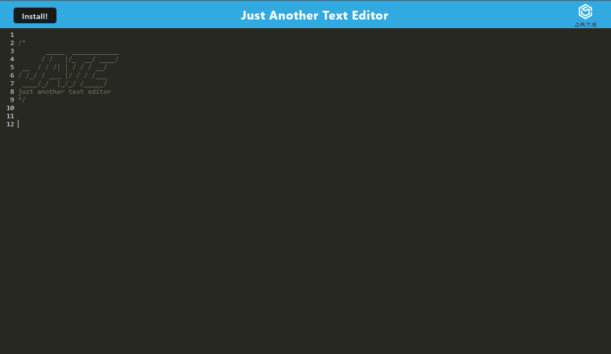
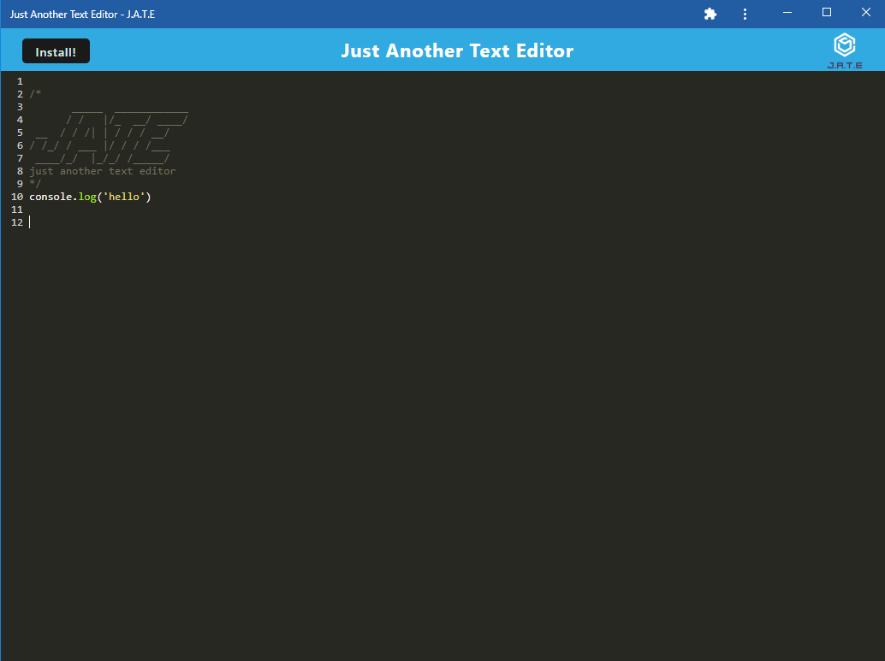

# JATE Text Editor 

## Technologies Used

## Table of Contents

\*[license](#license)

\*[title](#title)

\*[usage](#usage)

\*[livelink](#livelink)

\*[screenshots](#screenshots)

\*[description](#description)

\*[installation](#installation)

\*[tests](#tests)

\*[github](#github)

\*[email](#email)

## License

This project is licensed under the MIT license.
https://opensource.org/licenses/MIT

## Title
JATE

## Usage
An application that enables users to create, change and edit plain text. Great for coding!

## LiveLink
 https://dry-crag-11030-06ac3064255d.herokuapp.com/ 

## Screenshots

## Description
This application is a text editor that runs in the browser. This app is a single-page application that meets the PWA criteria. Additionally, it features a number of data persistence techniques that serve as redundancy in case one of the options is not supported by the browser. The application also functions offline.

## Installation
Clone the repo, install the dependencies, and run `npm start` to start the server.  Navigate to `localhost:3001` in your browser to view the application. If you want to see the live version, click the link above.

## Tests
N/A

## Challenge

## GitHub
https://github.com/JerrickJohnson/Progressive-Web-Applications-PWA-Text-Editor

## Questions:
### If you have any questions, contact me at
### GitHub: https://github.com/JerrickJohnson
### or
### Email: jerrickjohnson88@gmail.com
